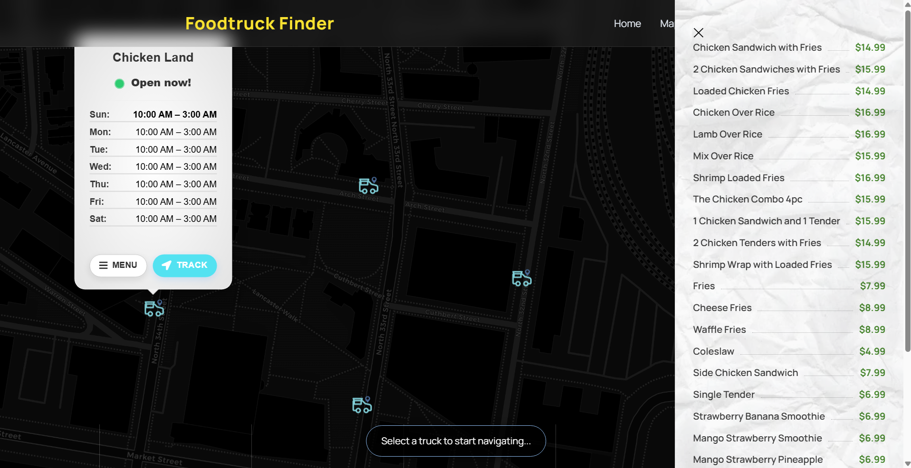

## Project Status
This project will not be worked on from 3/9/2026 to 3/29/2026, due to our developers taking a break.

# Drexel Food Truck Interactive Map
Drexel Food Truck Interactive Map is a map displaying food trucks on Drexel Campus. The application uses Flask and SQLAlchemy to manage food truck data and render it dynamically, allowing you to find food trucks and information about them easily.

## Features

- View food trucks
- View when food trucks are open
- View menu items for each truck
- Store and retrieve data using a database
- JSON responses for API-style endpoints
- Clean Flask + SQLAlchemy architecture
- Find quickest route to each truck

## Technologies Used

- Python 3.10+
- Flask
- Flask-SQLAlchemy
- SQLite
- HTML (Jinja templates)
- JavaScript
- Leaflet.js

## Image


## Installation
Follow these steps to run this project locally

1. Clone Repository

```bash
git clone <https://gitlab.cci.drexel.edu/cid/2526/ws1023/62/gc3/drexel-food-truck-interactive-map.git>
cd drexel-food-truck-interactive-map
```

2. Create and Activate a Virtual Environment

**Windows**
```bash
python -m venv venv
venv\Scripts\activate
```

**Windows Powershell**
```bash
python -m venv venv
venv\Scripts\Activate.ps1
```

**Mac / Linux**
```bash
python3 -m venv venv
source venv/bin/activate
```

When installing more packages for this project, be sure to activate the virtual enviroment in order for these installs to be saved inside of the venv folder. 

3. Install Required Dependencies 

```bash
pip install -r requirements.txt
```

4. Database Setup

This application runs on CSV files for food trucks, menu items, and operating hours. If you make any changes to any of these tables, run the following command in your terminal
```bash
python seed.py
```

5. Running the Application

Run this command to start up your locally hosted website

```bash
python run.py
```

## Roadmap
We plan on adding a reviews system in the future, along with adding more food trucks.

## Authors

- David Liberatore - Backend Developer, Database Design
- Andre Nunes Da Silva - Fullstack Developer, Leaflet Integration, HTML / CSS
- Alex Troeschel - Data Analyst, Leaflet Integration
- Kyle Cuba - Website Developer, HTML / CSS

## License
[MIT](https://gitlab.cci.drexel.edu/cid/2526/ws1023/62/gc3/drexel-food-truck-interactive-map/-/blob/main/LICENSE?ref_type=heads)