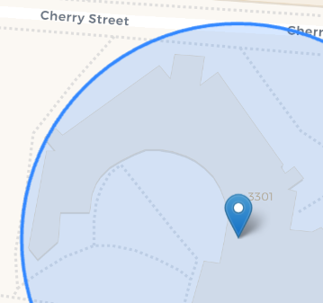
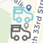

## Installation
Follow these steps to run this project locally

1. Clone Repository

```bash
git clone https://gitlab.cci.drexel.edu/cid/2526/ws1023/62/gc3/drexel-food-truck-interactive-map.git
cd drexel-food-truck-interactive-map
```

2. Create and Activate a Virtual Environment

**Windows**
```bash
python -m venv venv
venv\Scripts\activate
```

**Windows Powershell**
```bash
python -m venv venv
venv\Scripts\Activate.ps1
```

**Mac / Linux**
```bash
python3 -m venv venv
source venv/bin/activate
```

When installing more packages for this project, be sure to activate the virtual enviroment in order for these installs to be saved inside of the venv folder. 

3. Install Required Dependencies 

```bash
pip install -r requirements.txt
```

## Running the project
Run this command to start up your locally hosted website

```bash
python run.py
```

Once you run the above code, in your terminal, you should see the below:

* Running on http://xxx.x.x.x:xxxx
* Running on http://xx.xxx.xxx.xx:xxxx

Hold ctrl and click on either link. The website will open to the "Home" page.

### General Page Info
At the very top of the page, you will find the header. You can click "Home" for the home page, "Map" for the map page, "About" for the about page, or "Truck Submissions" for the forms page. This navigation bar is on each page.
At the very bottom of the page, you can find the footer. From here, you can click "Open Sourced" for the gitlab page, or "Contact Us" to contact us directly. This footer is on each page.

### Home Page
On the home page, you can scroll down to find information on our product. If you click on the "View on Gitlab" button, you will be brought to our websites gitlab. Near the top, if you click the "Get Started" button, you will be brought to the "Map" page.

### About Page
On the "About" page, there is a similar "View on Gitlab" link that leads to our gitlab page. If you scroll down on the "About" page, you can find each of our team members, our roles, and our contact info.

### Truck Submissions Page
On the "Truck Submissions" page, you can submit food trucks you want added to the map. To do this, first fill out the "Truck Name" section with the name of the truck. Then, click on the location on the map where the food truck is. Finally, press submit, and we will be able to see it.

## Map Page
The most important page where you can find information on food trucks. This page will be split up into multiple categories, so all information following this point refers to the "Map" page.

### Map
The largest thing on this page is the map itself. By using the scroll wheel, you can zoom in/out. By left clicking and moving your mouse, you can move around the map. There is a blue marker with a circle, shown below, to display your location if you allow the website to access it. Some features will only be accessible with tracking enabled. There are also markers for trucks, shown below in the second image, which can be either blue (open) or grey (closed). Hovering over truck markers displays the name of the truck, and clicking on one of these markers will open the truck menu, described below





### Truck Menu
A truck menu consists of information on the truck and buttons for more information. At the very top is the name of the truck, along with whether or not it is open. At the top right of the popup is an x to exit it, and at the top left, a button that favorites or unfavorites that truck when clicked. Below this is a list of times with the days of the week. An average rating is shown above the "See Reviews" button, which is above a "Menu" and "Track" button. "See Reviews" can be pressed to open the reviews menu, the "Menu" button opens a menu side panel, and "Track" starts tracking.

### Reviews Menu
To be fixed

### Menu Side Panel
When you press the "Menu" button on the truck menu of any truck, it opens a panel on the right third of the map. This panel displays menu items along with their price. Left clicking on any item will add the price to the estimated total at the bottom, which summarizes the estimated cost of the order containing all items you left clicked. This is cleared when you close the menu, open a new one, or press the "Clear Receipt" button at the very bottom of the side panel. Pressing the "X" button at the top left of the menu side panel will close it.

### Tracking
At the center of the bottom of the map, you can find a textbox saying "Select a truck to start navigating...". When navigating, this box will contain the text directions. On the truck menu of any truck, if you click the "Track" button, you will begin tracking for that truck. The text directions will be updated to show you your next direction, and above it will be a "Stop Tracking" button. Clicking this or the "Track" button of the truck currently being tracked will stop routing. Also, a blue line will appear on the map to show you how to get to the truck from where you are. This only works if you have location enabled, and your location hass been found.

### Sidebar
When you click on the "Trucks" button at the top left of the map, a sidebar will open on the left third of the map. Clicking the "Trucks" button again will close it. At the top, there are two buttons, "All Trucks" and "Favorites". Clicking either of these will filter the trucks shown based off if it's favorited, or just show all trucks. To the right of each food truck's name is a bookmark button, which allows you to favorite or unfavorite the truck when pressed. This sidebar contains all the food trucks by name. Clicking on any food truck's name will bring you to that food truck on the map.

### Light/Dark Mode
When you press the light/dark mode button in the bottom right of the map (denoted by a sun or moon symbol) the map changes from light to dark mode or dark to light mode.